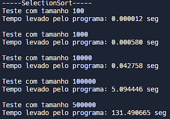
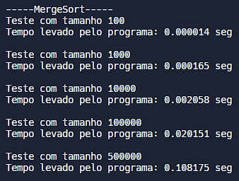
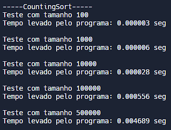
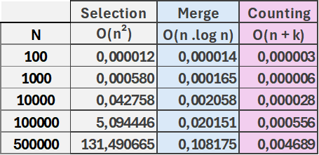
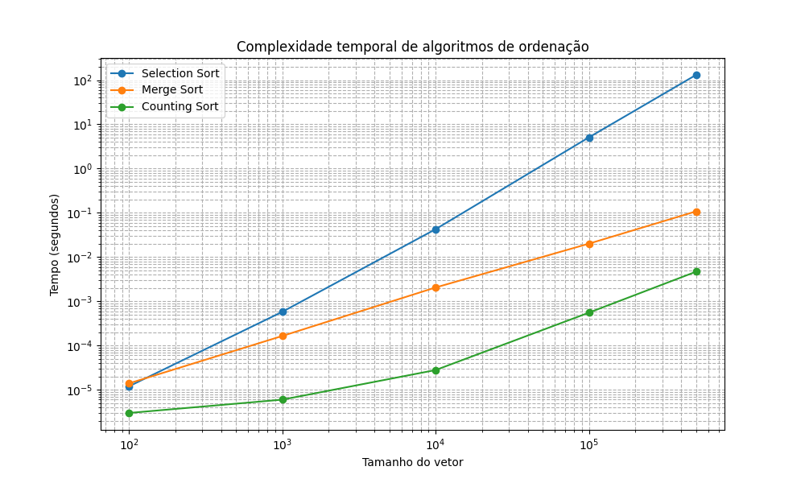

Disciplina IMD0029 - ESTRUTURA DE DADOS BÁSICAS I - T05 (2024.1)

# Análises

## Questão 1

Tempos de execução no replit:

Tabela comparando os tempos de execução:

## Questão 2

### Análise da relação entre o tempo de execução e a complexidade computacional dos algoritmos

#### SelectionSort
O algoritmo "SelectionSort" possui complexidade temporal de O(n²), independente do tamanho do vetor a ser ordenado.
Assim, embora não leve muito tempo com tamanhos pequenos de vetores, o tempo de execução cresce de maneira exponencial, como evidenciado na tabela exposta.

#### MergeSort
O algoritmo "MergeSort" possui complexidade temporal de Θ(n.log n) no caso médio, tornando-o muito mais eficiente conforme o tamanho do vetor cresce, um crescimento logarítmico.

Comparando com o SelectionSort, nota-se que a diferença proporcional entre as velocidades continua aumentando conforme o tamanho do vetor.

#### CountingSort
O algoritmo "CountingSort" possui complexidade temporal de Θ(n + k) no pior caso, onde k é o tamanho do maior valor presente no vetor a ser ordenado. Diferente do SelectionSort e MergeSort, que são algoritmos que comparam por meio da comparação, o CountingSort é um algoritmo de contagem, usando os valores dos elementos como índices para fazer isso. Nos testes propostos, o maior valor possível de ser gerado é 499999, tornando-o muito eficiente temporalmente para vetores com valores não muito elevados.
Como exposto na tabela, também foi o algoritmo mais rápido dentre os três testados, para todos os tamanhos de vetor.

#### Gráfico de linha
Segue abaixo um gráfico de linha que mostra o crescimento do tempo levado para ordenar cada vetor em determinados tamanhos utilizando cada um dos três algoritmos de ordenação, deixando mais claro como o crescimento de cada um deles acontece.

Um detalhe a se atentar é que, apesar do CountingSort ter sido mais rápido nos testes, o gráfico nos revela que o MergeSort possui um crescimento aparentemente constante, enquanto que o CountingSort cresce mais conforme o tamanho do vetor vai aumentando. Isso significa que, dado algum tamanho de vetor grande o suficiente, o MergeSort pode se tornar mais rápido.

(gráfico feito utilizando matplotlib do python)